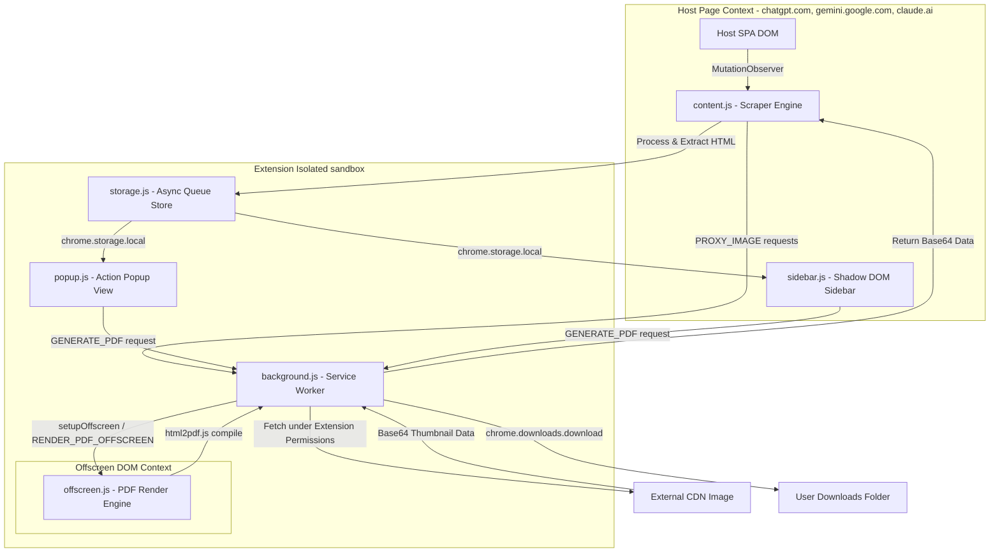

# ChatTrack Architecture Design Blueprint 📐

This document outlines the system architecture, message passing protocols, security hardening rules, and data structures of **ChatTrack**. It is intended to help developers understand how the extension interacts with host pages, manages local storage, and generates secure PDFs under the strict constraints of Chrome Extension Manifest V3.

---

## 1. System Architecture Overview

ChatTrack is split into four primary execution contexts:
1.  **Content Scripts (`content.js`, `sidebar.js`)**: Runs in the context of the host tab (ChatGPT, Gemini, Claude). Scrapes DOM trees, listens for page changes, and injects the UI.
2.  **Service Worker / Background Script (`background.js`)**: Handles extension events, acts as a keyboard command router, maintains a keep-alive cycle, and manages the lifecycle of offscreen helper contexts.
3.  **Offscreen Document (`offscreen.js`)**: An isolated, invisible DOM context created dynamically to execute layout operations and render PDFs safely.
4.  **UI Popup (`popup.js`)**: A standalone extension view triggered by the extensions bar icon, displaying stored prompts.



---

## 2. Sequence Workflow: PDF Generation

Manifest V3 Service Workers are run in a V8 isolated thread *without* DOM APIs. Since client-side PDF generation requires canvas layout calculations and window painting operations, ChatTrack dynamically offloads rendering to a temporary offscreen tab.

```mermaid
sequenceDiagram
    autonumber
    participant UI as popup.js / sidebar.js
    participant SW as background.js (Service Worker)
    participant OFF as offscreen.html/js (Canvas sandbox)
    participant DL as chrome.downloads

    UI->>SW: Send GENERATE_PDF (Raw HTML & Filename)
    Note over SW: Run setupOffscreen()
    SW->>SW: Check if Document exists?
    alt No Document
        SW->>SW: Create offscreen.html (DISPLAY_MEDIA reason)
    else Document Exists
        SW->>SW: Reset close inactivity timer
    end
    
    SW->>OFF: Send RENDER_PDF_OFFSCREEN (Sanitized HTML)
    Note over OFF: InnerHTML injected
    Note over OFF: Wait for all base64 images to trigger img.onload
    OFF->>OFF: html2pdf() Canvas paint & PDF generation
    OFF->>SW: Send PDF_RENDER_COMPLETE (Base64 PDF string)
    
    Note over SW: Close offscreen context (2s inactivity timeout)
    SW->>DL: downloads.download(dataUrl, filename)
    DL-->>User: File Saved to Disk
```

---

## 3. Component Deep Dive

### A. Scraper & Navigation Engine (`content.js`)
*   **Adaptive Selector Map (`PLATFORM_SELECTORS`)**: Configured with fallback arrays of query selectors tailored to ChatGPT, Gemini, and Claude user/assistant message roles. The script selects the first functional query selectors dynamically.
*   **Dynamic Change Listening**: Watches the chat container using a `MutationObserver` instance. A debounce timer of `800ms` aggregates changes before scraping to avoid thrashing CPU resources during active chat output streams.
*   **Tiered Target Navigation (`scrollToMessage`)**:
    *   *Tier 1*: Direct DOM query selectors lookup via the platform's native message UUID (`domMessageId`).
    *   *Tier 2*: Top-to-bottom traversal of DOM matching by sequence occurrence indices (`occurrenceNumber`) to scroll to exact message instances.
    *   *Tier 3*: Fallback to exact text queries for historical data backward compatibility.

### B. Secure Network Image Proxy (`background.js`)
To display and download user attachments (like DALL-E generated assets or custom prompts) without violating the host's strict Content Security Policies (CSP) or CORS, the background worker intercepts image urls and fetches them inside the extension’s privileged context.
*   **SSRF Mitigation Shield**:
    *   Blocks loopback, private networks, and internal ranges (e.g. `127.0.0.1`, `10.x.x.x`, `192.168.x.x`, `169.254.254.254`).
    *   Restricts protocol validation exclusively to `https:`.
    *   Blocks keywords pointing to internal resources (`localhost`, `metadata.google`, `.local`, `.internal`).
*   **Payload Constraints**: Enforces a `15000ms` fetch timeout via an `AbortController` and rejects responses whose headers do not match `image/*` or exceed `10MB`.

### C. Shadow DOM UI Wrapper (`sidebar.js`)
*   To bypass host CSS pollution, the extension attaches a Shadow Root to the body (`host.attachShadow({ mode: 'open' })`).
*   The entire CSS design system and markup are injected into the shadow container, preventing ChatGPT/Gemini framework classes from breaking ChatTrack's input composer, fuzzy search controls, and scrollbars.

### D. Concurrency-Safe Transaction Store (`storage.js`)
*   Multiple browser tabs accessing local storage concurrently will overwrite keys due to non-blocking I/O.
*   **Transaction Queue**: Features a serialization queue using an `_isSaving` state flag. Multiple write commands are queued asynchronously.
*   **Pruning & Cache Strategy**: Ensures `chrome.storage.local` stays under quota thresholds. When records exceed `MAX_PROMPTS (1000)`, it performs an LRU cache purge that preserves bookmarked entries while trimming oldest items.

---

## 4. Local Data Schema

Prompt records are structured as unified JSON objects stored under the `prompts` array in local storage:

```json
{
  "id": "e0e2946c-c6cc-46b0-95cb-64f51e89cfd3",
  "platform": "ChatGPT",
  "prompt": "Explain Quantum Cryptography in simple terms.",
  "answer": "<p>Quantum cryptography uses principles of quantum mechanics...</p>",
  "url": "https://chatgpt.com/c/65abc78d-1234-5678-abcd-ef0123456789",
  "messageIndex": 4,
  "occurrenceNumber": 0,
  "domMessageId": "8b5cf6-d2ef-4acb-88c9-0414ab21",
  "date": "2026-07-02T16:18:00.000Z",
  "promptImages": [
    "data:image/jpeg;base64,/9j/4AAQSkZJRgABAQEASABIAAD..."
  ],
  "bookmarked": true
}
```

### Data Fields Definition:
*   `id`: RFC 4122 random UUID string.
*   `platform`: Identifier string (`ChatGPT`, `Gemini`, `Claude`).
*   `prompt`: String content of the prompt text.
*   `answer`: Sanitized HTML structure of the assistant's response.
*   `messageIndex`: Sequence order index of the message inside the scraper loop (used for popup sorting).
*   `occurrenceNumber`: Zero-indexed occurrence number of identical texts (used for targeting page scroll actions).
*   `domMessageId`: Platform-specific message UUID mapped from DOM metadata classes.
*   `promptImages`: Base64 JPEG data URL array (compressed down to `120px` width thumbnails).
*   `bookmarked`: Boolean flag toggled by user stars.
